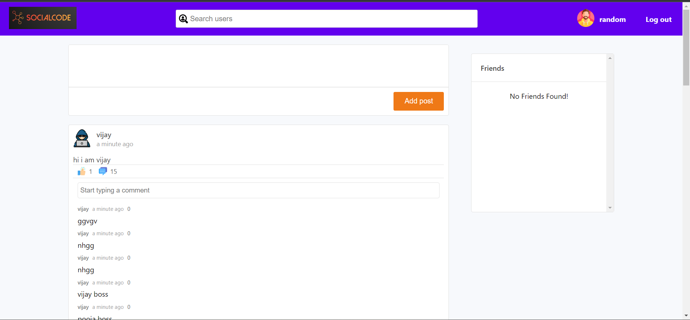

# Quora-like Social Messaging React App



This is a social messaging web application built using React that allows users to communicate and share messages, inspired by Quora. The app relies on an external API provider for its data.

## Features

- User registration and authentication.
- Create and edit user profiles.
- Create post and provide comments on post.
- Like and unlike post and comment.
- Add friends.
- Search users.
- User-friendly and intuitive interface.

## Technologies Used

- **React**: Front-end framework for building user interfaces.
- **[External API Provider]**: External API provider for messaging and question data.
- **[Other Libraries/Technologies]**:

## Getting Started

### Prerequisites

Before you begin, ensure you have met the following requirements:

- [Node.js](https://nodejs.org/) installed on your machine.
- An API key or credentials from the external API provider.

### Installation

1. Clone the repository:

   ```bash
   git clone https://github.com/your-username/quora-like-messaging-app.git

2. Change into the project directory:

    cd socialcode-react-app

3. Install dependencies:

    npm install

4. Start the development server:

    npm start

5. Open your web browser and navigate to http://localhost:3000 to access the app.


## Contributing
Contributions are welcome! Please feel free to submit a pull request or open an issue.

## Contact
If you have any questions or want to reach out, you can contact me at [yadavnirbhay2@gmail.com].